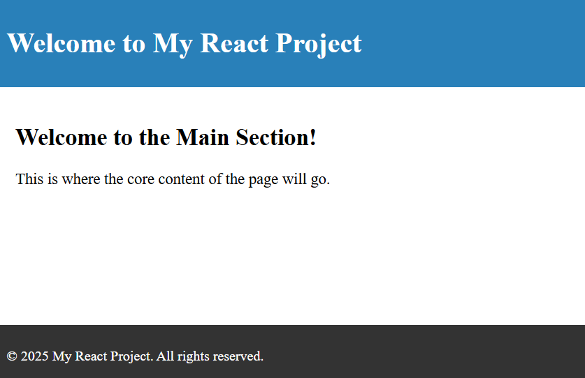

# Project Title

A brief description of your project goes here. 

This project is a template for starting new React applications quickly, with a simple structure and configuration. It includes basic setup for React, with pre-configured components and styles, making it easier to begin new projects without the need for setting up everything from scratch.

Feel free to customize and expand upon this template to suit your specific needs!


## Project Preview

Here is a visual representation of the project:



## Features

- Basic React setup with all essential dependencies.
- Pre-configured `App` component with simple structure.
- Easy-to-understand folder and file structure.
- Support for custom CSS styles and simple component styling.
- Configured for fast development and easy customization.
- Includes basic example components for quick testing and modifications.


## System Requirements

- **Node.js**: Version 14 or higher
- **npm**: Version 6 or higher
- **Git**: For version control (optional but recommended)
- A modern web browser (e.g., Chrome, Firefox, Safari, Edge)


## Installation Instructions

- Clone the repository:

   ```bash
   git clone https://github.com/username/project-name.git
   ```

- Navigate to the project directory:

   ```bash
   cd project-name
   ```

- Install dependencies:

   ```bash
   npm install
   ```

- Start the development server:

   ```bash
   npm start
   ```

- Open the application in your browser at [http://localhost:3000](http://localhost:3000).


## Usage

After setting up the project and running the development server, you can begin modifying the code and adding new features.

- The main application logic is located in the `src/App.js` file.
- Components are placed under the `src/components/` folder.
- Any global styles can be added to the `src/styles/` directory.
- You can edit the `src/index.js` to customize the entry point of the app if needed.


## How to Add New Components

1. Create a new file for the component in the `src/components/` directory.
2. Define the component using either a function or a class, depending on your preference.
3. Import the component into the appropriate file (e.g., `src/App.js`) to use it.
4. Add any necessary styles for your component in the `src/styles/` folder.
5. Test the component by running the development server and checking it in your browser.


## Contributing

We welcome contributions! If you have suggestions or want to fix bugs, please follow these steps:

1. Fork the repository.
2. Create a new branch (`git checkout -b feature-branch`).
3. Make your changes and commit them (`git commit -am 'Add new feature'`).
4. Push your changes (`git push origin feature-branch`).
5. Create a pull request with a description of what you've done.


## License

This project is licensed under the MIT License - see the [LICENSE](LICENSE) file for details.
